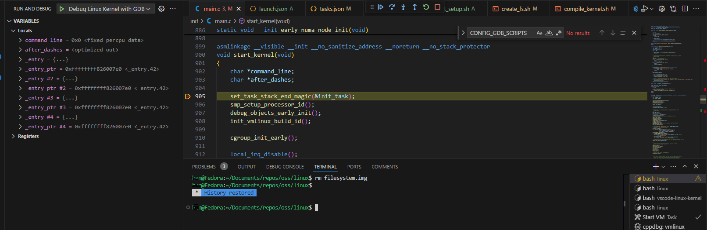
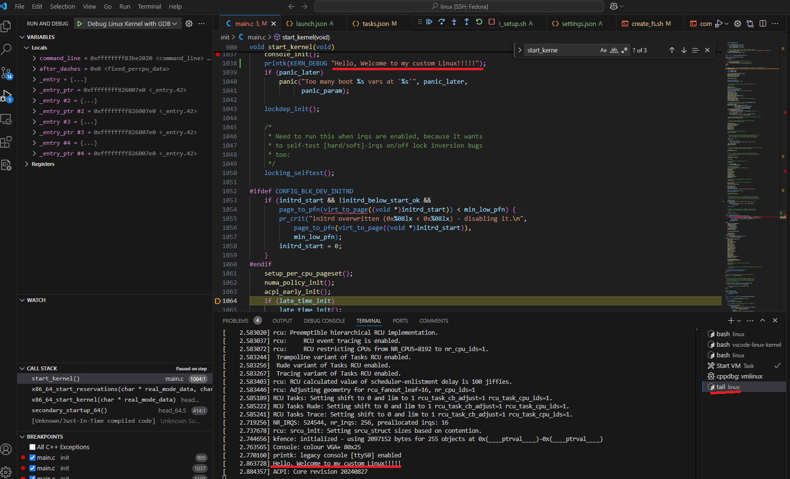
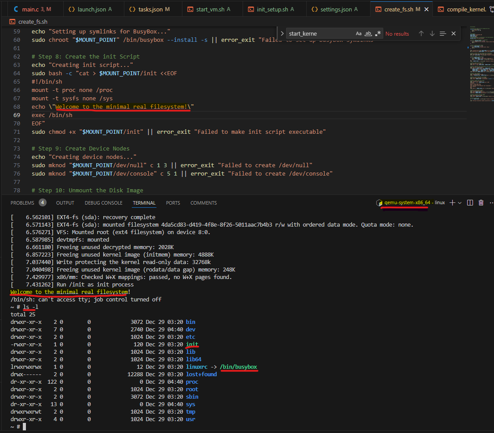

# Debug Linux Kernel With VS Code
VS Code Configuration For Linux Kernel Compiling and Debugging.

## Prerequistes
* Assume the Linux Distro is Fedora (41)
* Assume `busybox` is installed ( `sudo dnf install -y busybox`)
* Assume `qemu` is installed (`sudo dnf install -y qemu`)
* Assume `VS Code` is installed:  [VS Code Download](https://code.visualstudio.com/download)

## Scripts
* `init_setup.sh`: Initial setup, only need run once. It uses `./scripts/clang-tools/gen_compile_commands.py` to generate `compile_commands.json` used by `c_cpp_properties.json`. Also it generates debug configuration for `gdb` under `~/.gdbinit`.
* `compile_kernel.sh`: Compile the Linux Kernel with `Debug` info enabled.
* `create_fs.sh`: Create a rootfs image `filesystem.img` used for new built Kernel (so that it won't panic after all initialization. Not really required for Kernel debugging).
* `start_vm.sh`: Start `qemu` with new built kernel and wait for `gdb` to attach for debugging.

NOTE: Only `init_setup.sh` is needed to run ONCE manually. Other scripts are used by VS Code Tasks and will be called automatically.

## Steps To Compile And Debug the Kernel
#### 1. Clone Linux Kernel Source Code
```
mkdir -p ~/source
cd ~/source
git clone --depth 1 --branch master https://git.kernel.org/pub/scm/linux/kernel/git/torvalds/linux.git
```

#### 2. Clone This Repo And Copy to Kernel Source Folder
```
cd ~/source
git clone https://github.com/bgyu/vscode-linux-kernel.git
cp -pr ./vscode-linux-kernel/.vscode ./linux
cp -p ./vscode-linux-kernel/*.sh ./linux
```
#### 3. Run initial setup
```
cd ~/source/linux
./init_setup.sh

# Open VS Code In Current Folder
code .
```
Usually VS Code will prompt you to install some recommended extensions. Please follow the instruction to install them for better code experience. If not, you can install them manually:
* [C/C++ Extension Pack](https://marketplace.visualstudio.com/items?itemName=ms-vscode.cpptools-extension-pack)
* [Makefile Tools](https://marketplace.visualstudio.com/items?itemName=ms-vscode.makefile-tools)
* [kconfig](https://marketplace.visualstudio.com/items?itemName=luveti.kconfig)

#### 4. Start Compile And Debugging Linux Kernel
* Open `init/main.c` and set a breakpoint in `start_kernel` function
* Press `F5` to start Debugging. Linux Kernel is not built and rootfs is not created yet, VS Code will call the corresponding Tasks to start building the Kernel and creating the rootfs image. NOTE: When creating rootfs image `filesystem.img`, it will needs `root` previlige. It will prompt you to enter the password and continue. If you didn't see the prompt, you can manually run `create_fs.sh` to create the rootfs image. (The rootfs image will only create once).

It will take some time to build the Kernel (depends on how fast is your system). Once the Kernel is built and the rootfs image is created, the debugging will start automatically and the breakpoint will hit in `start_kernel` function.
  
The shortcut keys are the same with Visual Studio:
| Key Combination      | Action       |
|-----------------------|--------------|
| `F5`                 | Continue     |
| `F10`                | Step Over    |
| `F11`                | Step Into    |
| `Shift + F11`        | Step Out     |
| `Ctrl + Shift + F5`  | Restart      |
| `Shift + F5`         | Stop         |



NOTE: If you want to see the Kernel output, you need to run `tail -f serial.log` in a terminal:


Now you can enjoy the Linux Kernel Exploring!!!

## Play the New Kernel Without Debugging
If you just want to play the new Kernel without debugging, you can start it like this:
```
# Use default init from busybox, no graphic, run in terminal
qemu-system-x86_64 -kernel arch/x86_64/boot/bzImage -append "root=/dev/sda rw console=ttyS0" -drive file=filesystem.img,format=raw,if=ide -nographic

# Use the init created by this repo (Will panic if you exit)
qemu-system-x86_64 -kernel arch/x86_64/boot/bzImage -append "root=/dev/sda rw console=ttyS0 init=/init" -drive file=filesystem.img,format=raw,if=ide -nographic
```


## References
* https://docs.kernel.org/dev-tools/gdb-kernel-debugging.html
* https://github.com/bgyu/KB/blob/main/DebugLinuxKernel.md
* https://www.youtube.com/watch?v=D4k1Q3aHpT8&t=13s
